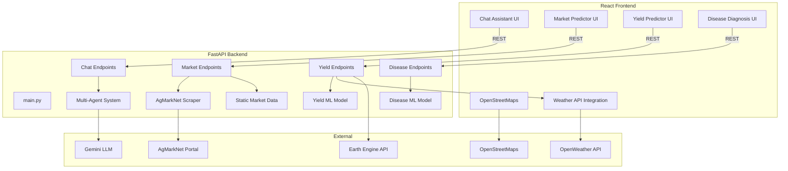

# CropIQ

> **CropIQ is an AI-powered agricultural decision support platform that helps farmers predict crop yield, forecast market prices, diagnose plant diseases, and receive intelligent farming assistance through a multi-agent AI system..**

---

## 🌐 Live Demo

Frontend: https://crop-iq-azure.vercel.app

Backend API: https://cropiq-1ijh.onrender.com


## 🚀 Overview
CropIQ is an advanced, multi-agent agricultural assistant designed for Indian farmers, agri-entrepreneurs, and researchers. It combines AI-driven chat, real-time yield prediction, market price forecasting, and disease diagnosis in a unified, modern platform.

- **AI Chat Assistant**: Nationwide agricultural expertise powered by Gemini LLMs
- **Market Price Prediction**: Real-time and historical mandi prices, time series forecasting
- **Yield Prediction**: Weather-aware, map-based, ML-driven yield estimates
- **Disease Diagnosis**: Crop image upload and instant disease detection
- **Professional UI/UX**: Responsive, modern design

---

## ✨ Features
- **Multi-Agent Chat**: Conversational assistant with intent routing and context memory
- **Market Data**: AgMarkNet scraping, static fallback, and forecasting
- **Yield Prediction**: Maps farm selection, OpenWeather integration, ML models
- **Disease Detection**: Deep learning or Gemini Vision analysis of crop images
- **Nationwide Coverage**: All major crops, markets, and Indian states
- **Modern UI**: Shareable conversations, streaming responses, mobile-first

---

## 🛠️ Tech Stack

**Backend:**
- Python, FastAPI
- Multi-agent system (Gemini LLM integration)
- Web scraping (AgMarkNet)
- ML models: yield, disease
- Caching, static data fallback

**Frontend:**
- React (Vite)
- Modular feature structure
- OpenStreetMaps, OpenWeather API
- Modern CSS Modules, context/hooks

---

## 📁 Project Structure

```plaintext
CropIQ/
├── backend/
│   ├── app/
│   │   ├── api/                 # FastAPI endpoints (market, yield, disease, chat)
│   │   ├── core/                # Multi-agent logic, AI services, config
│   │   ├── data/                # Static/fallback data
│   │   ├── models/              # Data models
│   │   ├── services/            # Scrapers, ML services
│   │   └── main.py              # FastAPI app entry point
│   ├── requirements.txt
│   └── .env
├── frontend/
│   ├── src/
│   │   ├── features/
│   │   │   ├── chat/            # Chat UI, avatars, animation
│   │   │   ├── market/          # Market price prediction UI
│   │   │   ├── yield/           # Yield prediction with map/weather
│   │   ├── components/          # Shared components
│   │   ├── services/            # API calls
│   │   └── theme/               # Theme (dark/light mode)
│   ├── public/
│   ├── package.json
│   └── .env
└── README.md
```

---

## 🏗️ Architecture

### System Overview



---

## 🖼️ Wireframes

### Home/Dashboard
- **Header**: Logo, navigation (Chat, Market, Yield, Disease), dark/light toggle
- **Main**: Quick links to features, latest market/yield highlights, user tips

### Chat Assistant
- **Left**: Conversation history, agent avatars
- **Center**: Chat window (Markdown, streaming), input box, send button
- **Right**: Contextual tips, share conversation

### Market Predictor
- **Top**: Select commodity, state, market
- **Main**: Price chart (historical & predicted), market info, refresh button
- **Side**: Data source info, last updated

### Yield Predictor
- **Map Panel**: Google Maps with farm selection
- **Form**: Crop, season, acreage, weather (auto-filled)
- **Output**: Predicted yield, recommendations

### Disease Diagnosis
- **Upload**: Image upload box
- **Result**: Detected disease, advice, treatment suggestions

---

## ⚡ Setup & Installation

### Clone 
 
```bash
git clone https://github.com/Aditya-Narsupalli/CropIQ.git
```

Before running the project, create `.env` files in the `backend` and `frontend` directories using the provided `.env.example` files.

### Backend (`backend/.env`)

```env
GEMINI_API_KEY=your_gemini_api_key
OPENWEATHER_API_KEY=your_openweather_api_key
```

### Frontend (`frontend/.env`)

```env
VITE_API_URL=http://localhost:8000
```

### Backend
```bash
cd backend
python -m venv venv
source venv/bin/activate  # or venv\Scripts\activate on Windows
pip install -r requirements.txt
uvicorn app.main:app --reload
```

### Frontend
```bash
cd frontend
npm install
npm run dev
```
